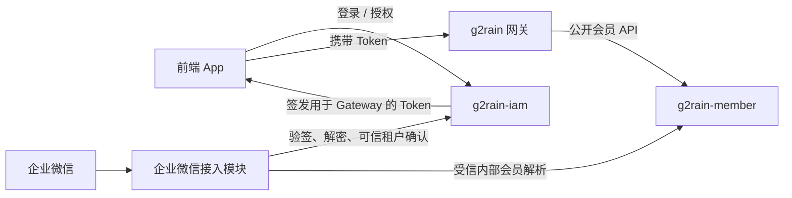

<p align="center">
  
</p>

# g2rain-member

[](https://github.com/g2rain/g2rain-member/blob/main/LICENSE)
[](https://openjdk.org/)
[](https://spring.io/projects/spring-boot)
[](https://maven.apache.org/)

g2rain 平台会员主数据与外部身份绑定服务，维护租户内会员、稳定会员编号、会员状态及企业微信等身份关系，并为可信接入渠道提供会员解析与幂等创建能力。

[官网](https://www.g2rain.com) · [完整文档](docs/index.md) · [架构说明](docs/architecture/overview.md) · [代码规范](docs/development/code-conventions.md) · [Git 工作流](docs/development/git-workflow.md) · [Issues](https://github.com/g2rain/g2rain/issues) · [Discussions](https://github.com/g2rain/g2rain/discussions)

## 项目定位

- 维护租户内会员主体、稳定会员编号、资料和状态。
- 维护会员与企业微信、手机号等外部身份的唯一绑定。
- 根据可信 `organId + externalUserId` 解析或事务性创建企业微信会员。
- 通过租户隔离、逻辑删除历史占位和资料白名单保护会员身份安全。

## 核心领域

| 领域 | 代表对象 | 主要职责 |
| --- | --- | --- |
| 会员主体 | `Member` | 维护会员编号、资料、状态和租户归属。 |
| 会员身份 | `MemberIdentity` | 维护企业微信、手机号等身份与会员的唯一绑定。 |
| 会员编号 | `MemberNoGenerator` | 生成稳定且无业务含义的会员编号。 |
| 企业微信识别 | `WechatWorkMemberResolver` | 解析已有身份或幂等创建会员与身份。 |
| 资料最小化 | `WechatWorkExternalProfileSanitizer` | 过滤允许落库的外部会员资料。 |

## 访问与调用关系



App 必须通过 Gateway 使用公开接口。企业微信接入模块必须先由 IAM 验证回调并取得可信租户上下文，再调用 Member 的内部解析接口；Member 不处理回调密文、签名或完整客服消息。

## 模块架构

```text
g2rain-member-api
  API、DTO、VO、枚举
          ↑
g2rain-member-biz
  Controller、Service、DAO、Domain、Converter
          ↑
g2rain-member-startup
  Spring Boot 启动、配置、观测和镜像构建
```

依赖只能沿 `startup → biz → api` 流动。

| 模块 | 职责 |
| --- | --- |
| `g2rain-member-api` | 发布会员、会员身份和企业微信内部解析契约。 |
| `g2rain-member-biz` | 实现领域规则、接口适配、数据访问和幂等创建。 |
| `g2rain-member-startup` | 组装可运行 Spring Boot 服务及 Jib 镜像。 |

## 技术栈

| 类别 | 技术 |
| --- | --- |
| 运行时 | Java 25、Spring Boot 4.0.5、Spring Cloud 2025.1.1 |
| 数据访问 | MyBatis、MySQL、MapStruct |
| 平台基础设施 | Redis、Nacos、平台数据隔离与安全 Starter |
| API 与文档 | Spring Web、Jakarta Validation、OpenAPI |
| 构建与部署 | Maven、Jib、Docker |
| 测试 | JUnit 5、Mockito |

## 快速开始

### 环境

- JDK 25
- Maven 3.9+
- MySQL 8+
- Redis（使用相关能力时）
- Nacos（使用 `nacos` profile 时）

### 初始化开发数据库

以下脚本会删除并重建会员表，只能用于首次初始化或可丢弃的开发库：

```bash
mysql -u root -p < scripts/g2rain-member.sql
```

### 构建与测试

```bash
mvn clean verify
```

### 启动服务

```bash
mvn -pl g2rain-member-startup -am spring-boot:run
```

默认端口 `8080`，默认 profile `dev`。健康检查：

```text
GET /actuator/health
```

## CRUD 代码生成

配置文件模式：

```bash
mvn g2rain-crafter:bootstrap
```

完整坐标及交互式模式：

```bash
mvn com.g2rain:g2rain-crafter:1.0.7:bootstrap -Dphase=foundry
```

缺少参数时的典型交互：

```text
请输入项目基础包名: com.g2rain.member
请输入数据库地址: jdbc:mysql://localhost:3306/g2rain_member
请输入待生成表（逗号分隔）: member,member_identity
是否覆盖已有文件 [y/N]: N
```

生成前保持 `tables.overwrite=false`，生成后审查 Git Diff，并补充租户一致性、事务、幂等、逻辑删除、资料最小化和测试。详见[CRUD 代码生成](docs/development/code-generation.md)。

## 项目文档

| 场景 | 入口 |
| --- | --- |
| 文档首页 | [docs/index.md](docs/index.md) |
| 架构总览 | [docs/architecture/overview.md](docs/architecture/overview.md) |
| 模块与依赖 | [docs/architecture/modules.md](docs/architecture/modules.md) |
| 核心运行流程 | [docs/architecture/runtime-flows.md](docs/architecture/runtime-flows.md) |
| 本地开发 | [docs/development/local-development.md](docs/development/local-development.md) |
| 代码规范 | [docs/development/code-conventions.md](docs/development/code-conventions.md) |
| AI Coding 入口 | [AGENTS.md](AGENTS.md) |
| 需求设计模板 | [docs/requirements/README.md](docs/requirements/README.md) |
| API 与数据库规范 | [API](docs/development/api-conventions.md) · [数据库](docs/development/database-conventions.md) |
| 测试与完成定义 | [测试策略](docs/development/testing.md) · [Definition of Done](docs/development/definition-of-done.md) |
| 安全与租户边界 | [docs/security/security-boundaries.md](docs/security/security-boundaries.md) |
| 参考实现与依赖治理 | [参考实现](docs/development/reference-implementation.md) · [依赖治理](docs/development/dependency-policy.md) |
| Git 分支与提交策略 | [docs/development/git-workflow.md](docs/development/git-workflow.md) |
| CRUD 代码生成 | [docs/development/code-generation.md](docs/development/code-generation.md) |
| 配置说明 | [docs/operations/configuration.md](docs/operations/configuration.md) |
| 构建与部署 | [docs/operations/deployment.md](docs/operations/deployment.md) |
| 可观测性 | [docs/operations/observability.md](docs/operations/observability.md) |
| 故障排查 | [docs/operations/troubleshooting.md](docs/operations/troubleshooting.md) |
| 会员编号设计 | [docs/design/member-no-generation.md](docs/design/member-no-generation.md) |
| 企业微信会员识别 | [docs/design/wechat-work-smart-customer-service-member-identification.md](docs/design/wechat-work-smart-customer-service-member-identification.md) |
| 社区与贡献 | [docs/community.md](docs/community.md) |

## 开发约定

- Controller 负责协议适配，事务、幂等、状态与租户规则位于 Service。
- 企业微信内部接口只接收可信租户、身份值和白名单资料。
- `WithoutIsolation` 数据访问必须伴随显式租户一致性校验。
- 会员与身份联合创建保持单事务；历史身份不得未经核验自动转移。
- 提交前执行 `mvn clean verify`，并同步更新受影响的文档或 ADR。

## AI Coding 工作方式

使用 AI Coding 实现需求时，从 [AGENTS.md](AGENTS.md) 开始。重要需求先按[需求设计与验收模板](docs/requirements/README.md)明确目标、非目标、业务规则和验收条件；实现期间遵循架构、代码、API、数据库和安全规范；完成前按[测试策略](docs/development/testing.md)和[完成定义](docs/development/definition-of-done.md)验证。

Agent 应直接读取当前源码、POM、配置、文档和文件差异进行动态检查，不需要在业务仓库中维护仅供 Agent 使用的验证脚本。

## 职责边界

本项目不负责：

- 平台登录、Passport、OAuth/OIDC、授权码或 Token 签发，这些由 `g2rain-iam` 负责。
- 企业微信回调验签、解密和客服消息拉取，这些由 IAM 与企业微信接入模块负责。
- 网关路由、统一入口鉴权和请求转发。
- 咨询、工单、订单、权益等会员下游业务。

## 贡献

欢迎通过 Issue、Discussion 和 Pull Request 参与 g2rain 建设。

代码贡献前请尽量补充必要的测试和文档，并确保构建、测试与静态检查通过。提交代码时，请同步更新受影响的 `docs` 文档；新增或改变长期架构决策时，在 `docs/decisions` 中增加 ADR。

分支与发布流程：

```text
feature/* 或 fix/* → develop → 测试环境验证 → main
```

- `main` 是稳定主分支，`develop` 是开发集成分支。
- 特性使用 `feature/<name>`，缺陷修复使用 `fix/<name>`。
- `feature/*` 和 `fix/*` 必须先合并到 `develop`；测试环境验证通过后，再由 `develop` 合并到 `main`。
- `main` 承担正式发布和版本升级；`common`、`starter` 等提供 JAR 的项目尤其需要在发布时检查并升级版本号。
- 完整规则见 [Git 分支与提交策略](docs/development/git-workflow.md)。

```bash
mvn clean verify
```

## 许可证

本项目基于 [Apache 2.0 许可证](https://github.com/g2rain/g2rain-member/blob/main/LICENSE) 开源。

## 联系我们

- 官网：[https://www.g2rain.com](https://www.g2rain.com)
- Issues：[GitHub Issues](https://github.com/g2rain/g2rain/issues)
- 讨论：[GitHub Discussions](https://github.com/g2rain/g2rain/discussions)
- 邮箱：[g2rain_developer@163.com](mailto:g2rain_developer@163.com)

## 致谢

感谢所有为 g2rain 项目提交 Issue、代码、文档、建议和使用反馈的开发者们！
