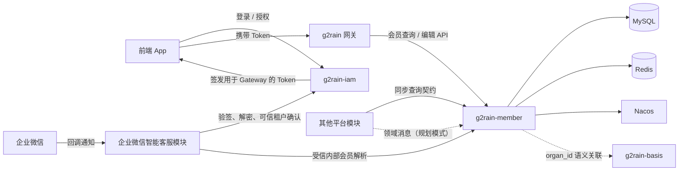

# 架构总览

本项目采用 g2rain [`java-domain-service 1.0.0`](https://github.com/g2rain/g2rain/tree/architecture-v1.0.0/docs/architecture/profiles/java-domain-service)。本页描述 Member 领域落地；相对中央基线的有意偏离见[架构例外](deviations.md)。

## 系统职责

`g2rain-member` 位于 g2rain 平台会员领域层，是租户内会员主数据和外部会员身份关系的权威服务。

它解决四类问题：

1. 为租户内会员维护稳定、无业务含义的会员编号和生命周期状态。
2. 将企业微信 `external_userid`、手机号等身份绑定到同一个会员主体。
3. 在可信渠道首次识别会员时，事务性、幂等地创建会员与身份。
4. 通过租户隔离、历史身份占位和资料最小化降低串租户及身份误绑定风险。

## 系统上下文



- 前端 App 从 IAM 获得 Token，再通过 Gateway 访问 Member 的公开接口。
- Member 对其他后端模块发布的同步契约以查询为主，不推荐其他模块直接调用通用保存、更新或删除接口。
- 会员数据编辑优先由 App 经 Gateway 调用 Member，由 Member 在自身领域边界内完成校验、事务和状态变化。
- 其他模块引起的会员数据变化优先通过领域消息表达，Member 监听消息后自主决定如何编辑自身数据。当前源码尚未实现这类消息消费者，图中虚线表示后续协作模式而非现有运行依赖。
- 企业微信智能客服模块（协议接入与咨询业务一体）先让 IAM 验证回调并取得可信 `organ_id`，拉取完整消息后才能调用 Member 的受信内部接口。
- Member 不接收企业微信回调密文、签名、拉取令牌或完整消息，也不为外部联系人创建 Passport 或 IAM Session。
- `member.organ_id` 与 Basis 的组织主数据存在语义关联；当前代码不因此声明对 `g2rain-basis-api` 的直接依赖。

## 容器与模块

```text
g2rain-member-startup
        │ depends on
        ▼
g2rain-member-biz
        │ depends on
        ▼
g2rain-member-api
```

API 模块发布稳定契约；Biz 模块实现会员规则、Web 适配和持久化；Startup 模块负责运行时组装。

## 核心领域

| 领域 | 代表对象 | 主要职责 |
| --- | --- | --- |
| 会员主体 | `Member` | 维护租户、会员编号、资料、状态和删除标识。 |
| 会员身份 | `MemberIdentity` | 维护会员与企业微信、手机号等身份的唯一绑定。 |
| 会员编号 | `MemberNoGenerator` | 根据全局 ID 生成稳定且无业务含义的展示编号。 |
| 企业微信识别 | `WechatWorkMemberResolver` | 根据可信租户和外部联系人标识解析或幂等创建会员。 |
| 资料最小化 | `WechatWorkExternalProfileSanitizer` | 仅保留允许落库的昵称、头像等必要资料。 |

## 非职责

- 不认证平台员工或会员，不签发 Token、授权码或 Session。
- 不负责企业微信回调验签、解密、消息拉取和消息幂等消费。
- 不承载咨询、工单、订单、权益等下游业务。
- 不实现网关路由、统一入口鉴权或管理端页面。
- 不向其他模块开放绕过 Member 领域规则的通用数据写入能力。

## 模块协作理念

Member 是会员数据的所有者，其他模块不应把它当作可远程操作的数据表。模块间协作遵循：

```text
同步协作：其他模块 → Member 查询契约 → 查询结果

交互编辑：App → Gateway → Member 写用例 → Member 自主校验并更新

事件驱动：其他模块发布领域事实 → Member 消费 → 幂等处理并更新自身数据
```

同步写入只适用于有明确业务语义、无法由 App 或领域消息合理完成的少数场景，必须通过需求设计和 ADR 说明调用方、权限、事务边界、幂等和兼容策略。
