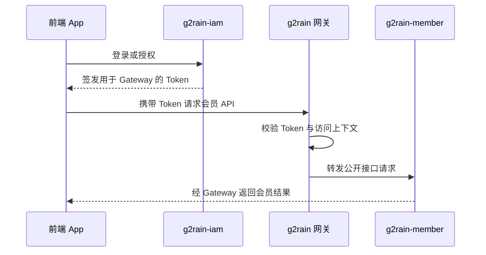
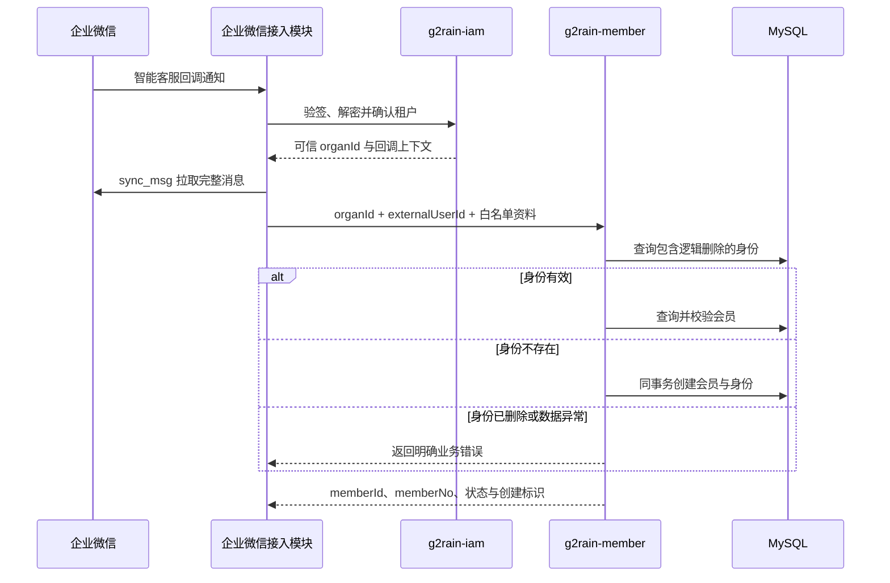
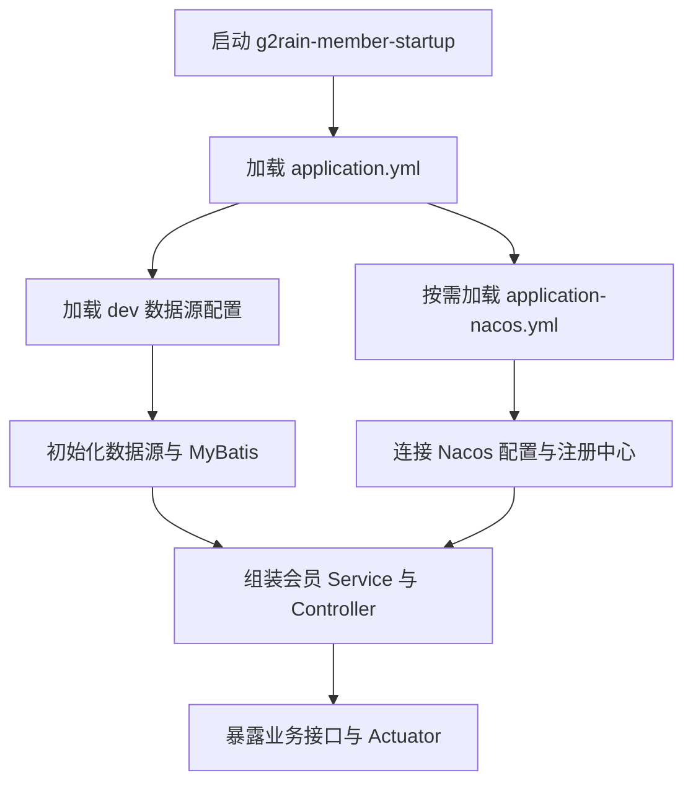

# 核心运行流程

## App 访问会员公开接口



App 和普通外部调用方不得使用企业微信会员解析的受信内部通道。

## 企业微信会员解析或创建



详细规则见[企业微信智能客服会员识别](../design/wechat-work-smart-customer-service-member-identification.md)。

## 并发首次创建

```text
查询身份不存在
→ 开启事务
→ 生成 member.id 与 member_no
→ 写入 member
→ 写入 member_identity
→ 若唯一键冲突：回滚当前事务
→ 回查既有身份并按状态返回
```

唯一键冲突不能遗留没有身份的孤立会员；已逻辑删除的身份继续占位，不能自动绑定给其他会员。

## 服务启动



