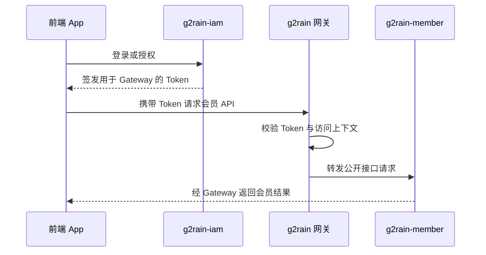
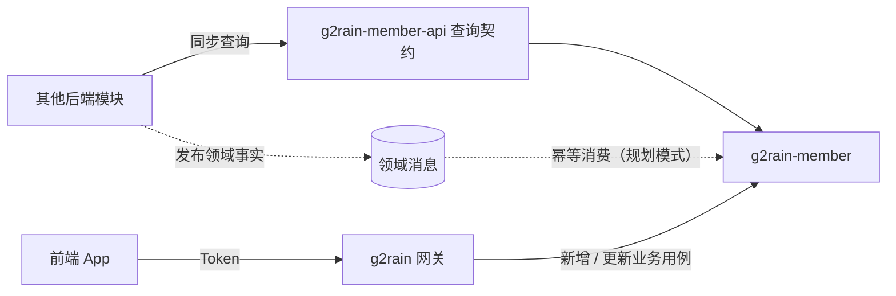
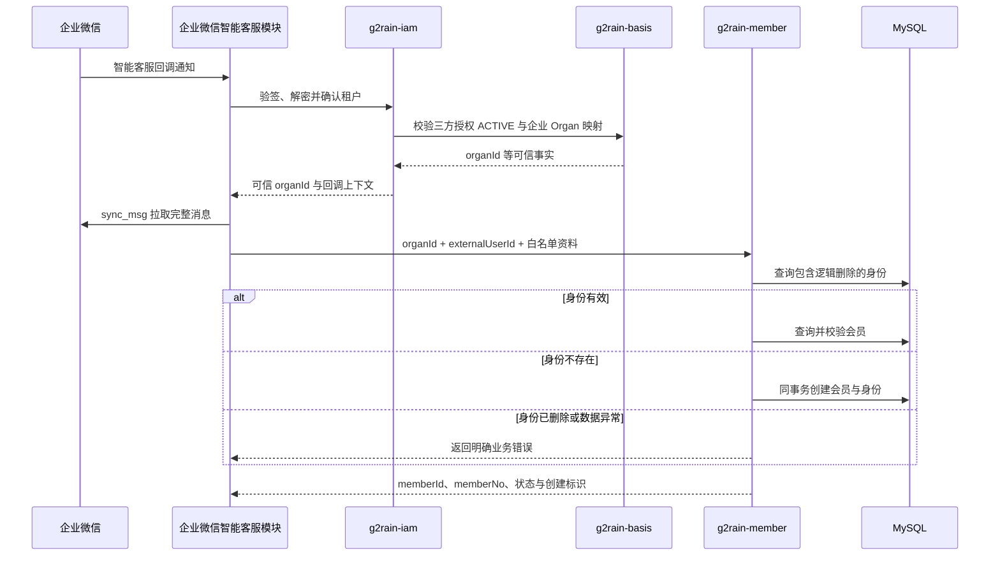
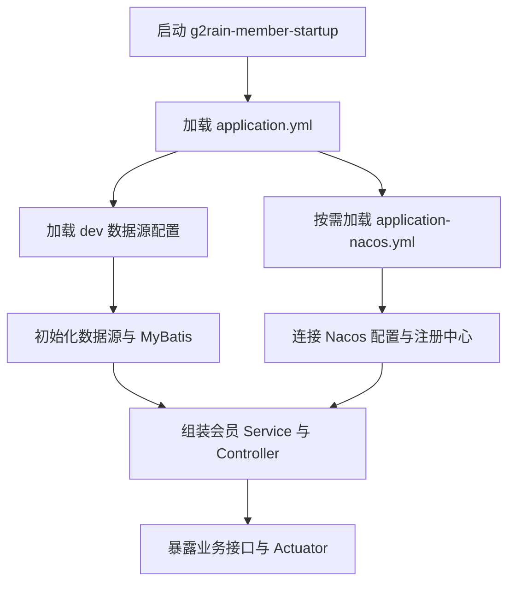

# 核心运行流程

## App 访问会员公开接口



App 和普通外部调用方不得使用企业微信会员解析的受信内部通道。

## 跨模块数据协作



- 其他后端模块同步调用 Member 时以查询为主，不直接使用通用保存、更新或删除接口。
- 交互式编辑由 App 经 Gateway 发起，Member 仍负责最终业务校验和数据变化。
- 非交互式跨模块变化优先由上游发布领域事实，Member 监听后自主更新。
- 虚线消息链路是架构推荐模式，当前源码尚未实现消息消费者；实现时必须补充事件契约、幂等、失败恢复、测试和运维说明。

## 企业微信会员解析或创建



详细规则见[企业微信智能客服会员识别](../design/wechat-work-smart-customer-service-member-identification.md)。开通 / 运行时 / 取消授权的四方交互时序见[企业微信客服机器人调用接口前的初始化](../design/wechat-work-customer-service-initialization.md) §3.1–§3.5。

## 并发首次创建

```text
查询身份不存在
→ 开启事务
→ 生成 member.id 与 member_no
→ 写入 member
→ 写入 member_identity
→ 若唯一键冲突：回滚当前事务
→ 回查既有身份并按状态返回
```

唯一键冲突不能遗留没有身份的孤立会员；已逻辑删除的身份继续占位，不能自动绑定给其他会员。

## 服务启动


