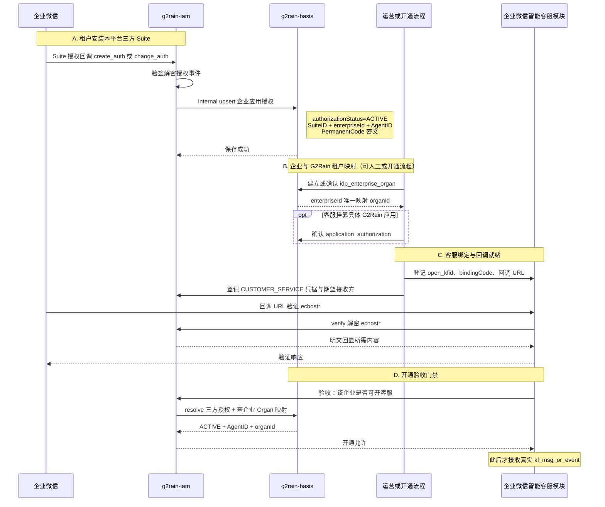
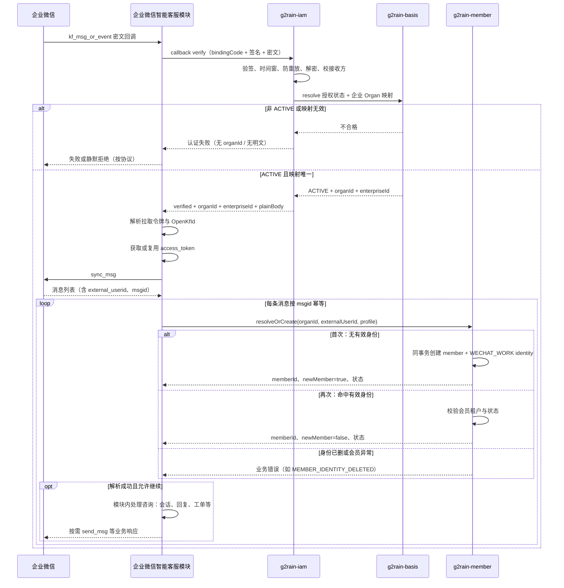
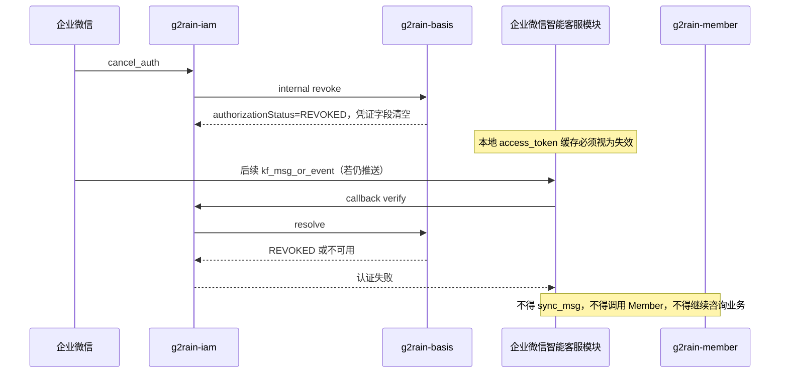

# 企业微信客服机器人调用接口前的初始化

## 1. 文档目的

本文说明企业微信智能客服（客服机器人 / 接入与业务一体链路）在调用平台业务接口或企业微信 `kf_*` 接口之前，必须完成的初始化步骤，并尽可能把链路中涉及的 **`g2rain-iam`、`g2rain-basis`、`g2rain-member`、企业微信智能客服模块** 的职责、数据依赖与协作关系写清楚。文档覆盖：

- **平台与租户侧一次性初始化**（接入开通，含 Basis 主数据、本平台三方 Suite 下租户认证状态，以及 IAM 回调凭据）
- **运行时渠道认证与凭据初始化**（IAM 验签解密、复核三方授权仍为 `ACTIVE`、企业微信 `access_token`、再调 `sync_msg`）
- **会员侧首次访问初始化**（外部联系人第一次发消息）
- **会员侧再次访问**（同一租户下已有企业微信身份的联系人）

更细的专题请交叉阅读：

| 主题 | 文档 |
| --- | --- |
| 会员识别、状态、可信级别 | [企业微信智能客服会员识别](./wechat-work-smart-customer-service-member-identification.md) |
| IAM 客服回调验签升级 | [IAM 客服回调认证升级设计](../../../g2rain-iam/docs/design/wecom-customer-service-callback-verification.md) |
| Basis 企业微信授权与 Organ 映射 | [Basis 企业微信三方应用授权与扫码登录](../../../g2rain-basis/docs/design/wechat-work-authorization.md) |
| IAM 扫码登录实现细节 | [IAM 企业微信扫码登录](../../../g2rain-iam/docs/design/wecom-qr-login.md) |

本文不替代上述专题，而是把「调用接口之前要就绪什么」按**开通 → 每次回调 → 首次/再次访问**串成一份可实施说明。

## 2. 范围与非职责

### 2.1 本文覆盖

- 接入配置、回调绑定、客服账号与租户映射是否就绪。
- `g2rain-iam` 在客服链路中的渠道认证职责、内部验证契约与现有能力基础。
- `g2rain-basis` 在客服链路中提供的租户主数据、企业–机构映射与授权关系，以及与员工扫码登录场景的差异。
- 调用 `/cgi-bin/kf/sync_msg` 前的访问令牌与拉取令牌就绪条件。
- 调用 `g2rain-member` 内部解析接口前的可信上下文。
- 接入与业务一体的企业微信智能客服模块、IAM、Basis、Member 的调用关系与开通 / 运行时 / 取消授权时序。
- 首次与再次访问在会员侧、业务侧的差异。

### 2.2 本文不覆盖

- 咨询话术、机器人意图、工单与订单等下游业务逻辑的细粒度实现（由企业微信智能客服模块内部承接，本文只约定其与 IAM / Basis / Member 的边界）。
- 为外部联系人签发 IAM Session / Passport（客服客户**不是**平台员工登录主体）。
- `sync_msg` 分页游标的存储结构与运维细节（属企业微信智能客服模块协议实现；Member / IAM / Basis 均不持久化该状态）。
- 企业微信 Suite 安装回调状态机的完整实现清单（见 Basis / IAM 授权专题）。

### 2.3 模块分工总览

本文中的 **企业微信智能客服模块**（下文可简称「客服模块」）是**单一部署/单一领域模块**：同时负责企业微信回调与 `kf_*` 协议接入，以及咨询会话、工单关联等客服业务处理。**不再**拆成独立的「客服模块」与「企业微信智能客服模块」。

| 能力 | `g2rain-basis` | `g2rain-iam` | 企业微信智能客服模块 | `g2rain-member` |
| --- | --- | --- | --- | --- |
| Organ / 企业映射 / IdP 企业授权主数据与状态 | 权威（含三方 `ACTIVE` 等） | 查询或受信解析 | 不直写 | 只消费可信 `organId` |
| 回调 `Token` / `EncodingAESKey` 验签解密 | 否 | 是 | 提交原始密文与签名 | 否 |
| 可信 `organId` 产出 | 提供映射与授权事实 | 验证后产出 | 只使用返回值 | 只使用请求中的可信值 |
| `access_token` / `sync_msg` / 消息幂等 | 否 | 否 | 是 | 否 |
| `member` / `member_identity` | 否 | 否 | 调用解析 | 权威 |
| 咨询会话 / 工单 / 业务编排 | 否 | 否 | 是（模块内能力） | 提供 `memberId` |
| 员工扫码登录 Session | 提供授权/映射查询 | 签发 Session | 不参与客服客户登录 | 不参与 |

## 3. 系统协作全景

```text
企业微信
   │  kf_msg_or_event 回调（密文 + 签名）
   ▼
企业微信智能客服模块
   │  原始签名参数、密文、bindingCode
   ▼
g2rain-iam  ──查询/校验──►  g2rain-basis
   │                         （企业授权、企业–Organ 映射等）
   │  verified + organId + enterpriseId + plainBody
   ▼
企业微信智能客服模块
   │  access_token + 拉取令牌 → sync_msg
   │  取出 external_userid（按 msgid 幂等）
   ▼
g2rain-member  resolveOrCreate
   │  memberId / memberNo / status / newMember
   ▼
企业微信智能客服模块（模块内继续咨询业务，可再调订单等下游）
```

关键约束：

- 回调通知本身**不是**完整消息；未完成 IAM 验证与 `sync_msg` 前，不得调用 Member。
- `organId`、`external_userid` 不得由普通请求参数伪造。
- Member 不接收回调密文、签名、拉取令牌、访问令牌或完整客服正文。
- 客服外部联系人**不会**因此获得 Passport 或 IAM 登录 Session；IAM 在此链路只做**渠道认证与租户确认**。

### 3.1 调用关系约定

四方之间的**允许调用方向**如下（箭头表示「谁发起调用」）：

```text
企业微信 ──回调──► 客服模块
企业微信 ◄─kf API─ 客服模块

客服模块 ──内部验签──► IAM
客服模块 ──resolveOrCreate──► Member
客服模块 ──（可选）业务 API──► 订单 / 权益等下游服务

IAM ──upsert / revoke / resolve──► Basis
IAM ──（可选）读映射 / 授权事实──► Basis

客服模块 ──╳──► Basis     （客服链路上不直连 Basis；定租户经 IAM）
Member   ──╳──► IAM       （不验签、不换票）
Member   ──╳──► Basis     （不查授权表；只消费请求中的可信 organId）
Basis    ──╳──► Member    （不创建会员）
```

| 调用 | 协议语义（名称以实现为准） | 主要载荷 |
| --- | --- | --- |
| 客服模块 → IAM | `POST /internal/wecom/callback/verify` | `callbackType=CUSTOMER_SERVICE`、`bindingCode`、签名参数、密文 |
| IAM → Basis | `resolve` / 映射查询；开通期另有 `upsert` / `revoke` | SuiteID、enterpriseId、授权状态、`organId` |
| 客服模块 → 企业微信 | `/cgi-bin/kf/sync_msg` 等 | `access_token`、拉取令牌、`open_kfid` |
| 客服模块 → Member | `POST .../resolve_or_create` | 可信 `organId`、`externalUserId`、白名单资料 |
| 客服模块 → 下游业务 | 同步或异步业务调用 | `memberId`、消息摘要、会话键 |

### 3.2 开通阶段交互时序（三方 Suite + 客服就绪）

开通发生在首条客户消息之前。目标：Basis 中该企业对本平台 Suite 为 `ACTIVE`，企业–Organ 映射唯一，客服 binding 与回调凭据可用。



开通失败时不得启用生产 binding：例如 `PENDING` / `REVOKED` / 无授权记录、映射不唯一、URL 验证失败。

### 3.3 运行时交互时序（每条客服通知）

企业微信智能客服模块是编排者（协议接入 + 业务处理一体）；IAM 定渠道与租户；Basis 只被 IAM 查询；Member 只在可信消息就绪后出现。



要点：

- **客服模块不直连 Basis**：授权是否 `ACTIVE`、`organId` 是多少，一律经 IAM 返回值使用。  
- **Member 不参与验签 / sync_msg / 咨询编排**：只接收已收敛的 `organId` 与 `external_userid`，返回稳定 `memberId`。  
- **协议接入与业务处理同属客服模块**；图中 `CS->>CS` 表示模块内步骤，不是跨服务调用。  
- **首次与再次**共用同一 Member 接口；差异只在 Member 内部是否建档（见第 8、9 节）。

### 3.4 取消授权时序（运行中失效）



企业重新安装 Suite 并恢复 `ACTIVE` 后，还需再次确认企业–Organ 映射与客服 binding 仍有效，才能回到 §3.3 正常路径。

### 3.5 交互一览（按阶段）

| 阶段 | 企业微信智能客服模块 | IAM | Basis | Member |
| --- | --- | --- | --- | --- |
| Suite 安装 / 变更 / 取消 | 不参与授权写路径 | 收授权回调并 upsert/revoke | 持久化授权状态与密文 | 不参与 |
| 企业–Organ 映射 | 不直写 | 可读 | 权威写入 / 查询 | 不参与 |
| 客服 binding / URL 验证 | 登记并响应 echostr | 解密验证 | 不参与凭据明文 | 不参与 |
| 每条客服消息 | 编排：验签→拉消息→调会员→模块内业务 | 验签并返回 organId | 被 IAM 查询 | resolveOrCreate |
| 取消授权后 | 拒绝后续消息与业务 | 拒绝给出可用 organId | 保持 REVOKED | 不被调用 |

## 4. g2rain-iam：渠道认证与运行时初始化角色

### 4.1 在客服链路中的定位

`g2rain-iam` 回答两个问题：

1. 这条回调是否确实来自企业微信、且未被篡改/重放？
2. 解密后的企业标识对应哪个**可信** G2Rain 租户 `organId`？

它**不**回答：这条消息的业务内容是什么、客户是哪个会员、应如何回复。那些由企业微信智能客服模块与 Member 分工负责：Member 识别会员，客服模块处理咨询业务。

设计结论摘要（与 IAM 升级设计一致）：

```text
企业微信客服回调
        ↓
企业微信智能客服模块
        ↓ 原始签名参数与密文
g2rain-iam 回调认证能力
        ↓ 已验证的回调明文与租户上下文
企业微信智能客服模块解析 kf_msg_or_event
        ↓
调用 sync_msg 拉取完整消息
        ↓
g2rain-member 识别会员
```

### 4.2 IAM 负责 / 不负责

**负责：**

- 管理或安全访问企业微信回调 `Token`、`EncodingAESKey`。
- 按 `callbackType`（至少区分 `THIRD_PARTY_AUTHORIZATION` 与 `CUSTOMER_SERVICE`）和不可伪造的 `bindingCode` 选择凭据。
- 校验签名、时间戳窗口、随机串；解密密文并校验明文接收方与配置一致。
- 在短时间窗口内拒绝完全相同的重放认证请求。
- 根据已验证企业标识与有效授权/映射关系解析 `organId`（依赖 Basis 侧事实，见第 5 节；**三方正式环境必须确认该企业对本平台 Suite 的授权为 `ACTIVE`**）。
- 返回最小化的可信回调结果；记录不含密钥与明文正文的审计日志。
- 认证租户员工、人工客服、后台管理人员，以及服务间内部调用（与「外部联系人无 Session」并行存在，场景不同）。
- 处理 Suite 授权回调（`suite_ticket`、`create_auth`、`change_auth`、`cancel_auth`），经受信接口将租户认证状态同步到 Basis。

**不负责：**

- 不解析或处理客服业务消息正文。
- 不调用 `sync_msg`、`send_msg` 等微信客服业务接口。
- 不持久化拉取游标、客服消息、对话或工单。
- 不根据 `external_userid` 查询或创建会员。
- 不把微信客户注册成 `passport`，不为其签发 IAM Session 或用户 Token。

### 4.3 现有能力基础与客服升级差距

IAM 已具备企业微信相关基础，客服回调认证是在其上的扩展，而不是另起一套密码学栈：

| 现有基础 | 说明 |
| --- | --- |
| `WeComIamProperties` | 内部应用、第三方服务商、Suite、回调密钥等配置入口 |
| `WeComCallbackCrypto` | SHA-1 签名校验、AES 解密、PKCS#7 去填充、接收方校验 |
| `WeComAuthorizationCallbackController` / `WeComAuthorizationService` | 第三方授权回调：`suite_ticket`、`create_auth`、`change_auth`、`cancel_auth` |
| 扫码登录 Adapter | 企业内部 / 服务商三方换票与 Session（与客服客户无关） |

相对客服回调的差距（开通与实现前必须闭合）：

| 项目 | 当前偏授权回调 | 客服回调需要 |
| --- | --- | --- |
| 密钥选择 | 固定读第三方 Token/AESKey | 按场景与绑定选择凭据 |
| 接收方校验 | 常固定为 SuiteID | 按客服接入模式校验 CorpID / SuiteID / 配置期望值 |
| 事件范围 | 授权安装类事件 | `kf_msg_or_event` 等客服通知 |
| 时间窗口 / 防重放 | 不完善 | 独立时间偏差限制 + 短窗防重放 |
| 调用方式 | 授权控制器内聚 | 向客服模块提供受保护的内部验证能力 |
| 租户上下文 | 授权流程侧处理企业授权 | 验证后显式返回可信 `organId` |

新增客服能力时必须兼容现有授权安装、更新、取消流程，不得破坏扫码登录。

### 4.4 回调凭据模型（开通阶段写入，运行时只解析）

建议拆分：

```text
WeComCallbackCredentialResolver
    ↓
WeComCallbackCredential
    - callbackType          // CUSTOMER_SERVICE 等
    - bindingCode           // 平台生成，定位接入绑定
    - token                 // 企业微信回调 Token
    - encodingAesKey
    - expectedReceiver
    - organId / 授权引用    // 或解析时再查 Basis
    ↓
WeComCallbackVerifier
    - verifySignature / validateTimestamp / rejectReplay
    - decrypt / validateReceiver
```

约束：

- `bindingCode` 由平台在配置回调地址时生成；外部请求不得直接指定 `organId`，也不得覆盖期望接收方。
- 凭据可存于 Nacos、KMS 或受信持久化配置；**企业微信智能客服模块与 Member 不得获得明文 Token / EncodingAESKey**。
- `CUSTOMER_SERVICE` 不得误用仅适用于 Suite 授权回调的凭据，除非企业微信后台确认为同一套配置且已评审。

### 4.5 建议的内部验证契约

客服模块独立部署时，IAM 提供仅限内部调用的能力（名称以实现为准）：

```text
POST /internal/wecom/callback/verify
```

请求示例：

```json
{
  "callbackType": "CUSTOMER_SERVICE",
  "bindingCode": "平台生成的接入绑定标识",
  "msgSignature": "企业微信签名",
  "timestamp": "时间戳",
  "nonce": "随机串",
  "encryptedBody": "原始加密 XML"
}
```

响应示例：

```json
{
  "verified": true,
  "organId": 10001,
  "enterpriseId": "ww...",
  "callbackType": "CUSTOMER_SERVICE",
  "plainBody": "已解密 XML",
  "verifiedAt": "2026-08-20T10:00:00+08:00"
}
```

约束：

- 必须经过平台内部应用认证，禁止匿名公网调用。
- `verified=false` 时不返回明文与租户信息。
- 响应不得包含回调密钥、企业访问令牌、PermanentCode。
- `organId` 必须由 IAM 根据已验证配置与 Basis 授权/映射关系产生，不能回显请求参数。
- `plainBody` 仅供客服模块解析通知；IAM 日志不得输出明文正文。
- 同进程部署时可用等价 Java Service，契约语义保持一致。

### 4.6 IAM 验证顺序（每次回调）

1. 校验必要参数存在且长度合法。  
2. 校验时间戳与服务器时间偏差不超过配置窗口。  
3. 用 `Token + timestamp + nonce + Encrypt` 计算签名并常量时间比较。  
4. 登记回调指纹，拒绝窗口内重放。  
5. 用 `EncodingAESKey` 解密并校验填充、长度与 UTF-8。  
6. 校验明文接收方等于凭据 `expectedReceiver`。  
7. 读取企业标识，结合 Basis 授权/映射解析有效 `organId`（三方正式环境必须确认对本平台 Suite 为 `ACTIVE`）。  
8. 返回最小化已验证结果。

任一步失败：客服模块**停止**后续 `sync_msg` 与 Member 调用。

### 4.7 与「员工扫码登录」的边界（避免混用）

| 对比项 | 员工 / 管理员扫码登录 | 智能客服外部联系人 |
| --- | --- | --- |
| IAM 结果 | Passport + Session / OAuth Token | 仅回调渠道可信 + `organId` |
| 主体 | 企业成员（内部 UserID / open_userid） | 微信客户 `external_userid` |
| Basis 校验重点 | 三方模式下常校验 Suite 安装授权；`idp_enterprise_organ` **不是**扫码登录前置 | 客服回调必须能唯一解析 `organId`；通常更依赖企业–Organ 映射与客服绑定 |
| Member | 不创建会员 | 解析或创建 `member` |
| 能否调业务 API | 持用户/员工 Token 经 Gateway | 由接入/业务服务以**服务身份**调用；不是客户本人登录 |

客服初始化**不要**套用扫码登录的「自动开户 Passport」路径。

## 5. g2rain-basis：租户主数据与授权事实

### 5.1 在客服链路中的定位

`g2rain-basis` 是平台组织、应用授权、IdP 企业关系的权威主数据服务。对智能客服而言，Basis 主要提供：

- 租户主体 `organ`（`organId` 的权威定义）
- 外部企业标识与 Organ 的映射（`idp_enterprise_organ`）
- 外部 IdP 企业应用安装授权（`idp_enterprise_application_authorization`，企业微信 Suite / Agent 等）
- G2Rain 应用对机构的使用授权（`application_authorization`，与「企业是否安装了企微 Suite」不是同一件事）

IAM 在验签成功后解析 `organId` 时，必须依赖这些**已配置且有效**的事实；Member 只接收最终的 `organId`，不自行「猜测」租户。

### 5.2 关键数据表与职责边界

| 表 / 模型 | 职责 | 与客服初始化的关系 |
| --- | --- | --- |
| `organ` | G2Rain 租户 / 机构 | `member.organ_id` 与 IAM 返回的 `organId` 最终指向这里 |
| `idp_enterprise_organ` | 外部企业 ID ↔ Organ | 客服回调按企业标识定租户时的核心映射 |
| `idp_enterprise_application_authorization` | 外部企业是否安装并授权了 IdP 应用（Suite 等）；PermanentCode 密文 | 证明企业侧应用授权有效；**不**存客服消息 |
| `application_authorization` | Organ 是否可使用某个 **G2Rain** 应用 | 与企微安装授权分离；客服业务若挂在具体 G2Rain 应用下，开通阶段需单独确认 |
| `application_idp_provision` | IdP 应用标识与 G2Rain 应用映射 | 多应用 / 多 Suite 场景下的配置关联 |
| `passport_idp_binding` | Passport ↔ 外部员工身份 | **客服外部联系人不用此表** |

`application_authorization` **不得**用来存储企业微信 PermanentCode、SuiteID 或取消授权状态；那是 `idp_enterprise_application_authorization` 的职责。

三类授权的分层关系（数据层）：

```text
企业微信安装授权
idp_enterprise_application_authorization
        │  证明外部企业安装了企业微信 Suite / 应用
        ▼
idp_enterprise_organ
        │  将外部企业映射到 G2Rain Organ
        ▼
application_authorization
           该 Organ 可以使用哪些 G2Rain 应用
```

分别回答：

1. 外部企业是否安装并授权了 IdP 应用？  
2. 外部企业对应哪个 G2Rain Organ？  
3. 该 Organ 可以使用哪些 G2Rain 应用？

企业微信 Suite 安装成功**不会**自动创建 `idp_enterprise_organ` 或 `application_authorization`。客服开通若依赖租户映射，必须在开通清单中**显式**完成映射（及必要的 G2Rain 应用授权）。

### 5.3 三方应用（本平台提供的 Suite）下的租户认证状态要求

正式 SaaS / 多企业租户场景下，企业微信接入默认采用**服务商三方应用**（`bindMode = THIRD_PARTY`）：由**本平台作为服务商**提供 Suite，各租户企业在企业微信侧安装并授权该 Suite 后，才允许进入平台相关能力（含智能客服初始化与运行时处理）。

本节约定：客服链路对「租户是否已完成三方应用认证」的**硬性状态要求**。数据权威在 Basis 表 `idp_enterprise_application_authorization`；IAM 在解析可信 `organId` 或换取企业侧调用凭据前必须校验，不得跳过。

#### 5.3.1 定位与字段语义

| 概念 | 取值 / 说明 |
| --- | --- |
| 接入形态 | `bindMode = THIRD_PARTY`（正式上线默认；区别于联调用的 `INTERNAL`） |
| IdP 类型 | `idpType = WECHAT_WORK` |
| 本平台 Suite | `idp_application_code = SuiteID`（平台提供的三方应用标识） |
| 租户企业 | `enterprise_id`：授权企业 CorpID 或服务商主体下的企业标识 |
| 企业内应用实例 | `installed_application_id = AgentID` |
| 认证状态 | `authorization_status` ∈ `PENDING` / `ACTIVE` / `REVOKED` / `EXPIRED` |

状态由 IAM 处理企业微信授权回调后写入 Basis（`create_auth` / `change_auth` → upsert；`cancel_auth` → revoke），客服模块与 Member **不得**自行改写该状态。

#### 5.3.2 状态机与客服是否允许继续

| `authorization_status` | 含义 | 智能客服开通 / 每次回调 |
| --- | --- | --- |
| `PENDING` | 临时授权阶段，可能尚无 AgentID | **不允许**。不得完成客服开通验收，不得对客户消息调用 `sync_msg` / Member |
| `ACTIVE` | 企业已安装并授权本平台 Suite，且具备有效 AgentID 与凭证密文 | **允许**（尚须同时满足企业–Organ 映射等其它开通项） |
| `REVOKED` | 企业取消授权或平台侧撤销 | **立即拒绝**。IAM 不得再给出可用于客服的可信租户上下文；已开通绑定应视为失效 |
| `EXPIRED` | 授权过期（若产品启用过期语义） | **拒绝**，与 `REVOKED` 同等对待，直至重新授权恢复为 `ACTIVE` |
| 无记录 | 企业从未安装本平台 Suite，或记录不可见 | **拒绝**（等价于未认证） |

对客服链路的产品结论：

```text
仅当
  idpType = WECHAT_WORK
  AND bindMode = THIRD_PARTY
  AND idpApplicationCode = 本平台 SuiteID
  AND enterpriseId = 回调已验证企业标识
  AND authorizationStatus = ACTIVE
  AND installedApplicationId（AgentID）非空
时，才认为「该租户对企业微信三方应用的认证状态合格」。
```

`ACTIVE` 写入或恢复时：**AgentID 必须非空**；不满足则 Basis 应拒绝更新为 `ACTIVE`。`PENDING` 允许 AgentID 为空，但客服不得把 `PENDING` 当作可用状态。

#### 5.3.3 与员工扫码登录门禁对齐、且更严于「仅登录」

三方扫码登录已规定：进入 IAM Session 前必须 `resolve` 授权且状态为 `ACTIVE`，并校验登录返回的 AgentID 与授权记录一致；`REVOKED` / 空记录拒绝登录。

智能客服采用**同一套租户认证状态门禁**，并额外强调：

1. **每次**客服回调在 IAM 定租户时重新确认状态仍为 `ACTIVE`（不能只在开通日检查一次）。  
2. 取消授权（`cancel_auth`）后 Basis 将状态置为 `REVOKED` 并清空持久化凭证字段；客服必须马上失败，即使本地仍缓存旧的 `access_token` 或 binding。  
3. 企业重新安装 Suite 后，记录幂等恢复为 `ACTIVE` 并更新 AgentID / 凭证密文；恢复后需再次确认企业–Organ 映射与客服 binding 仍有效，才能继续处理消息。  
4. 扫码登录**不**强制 `idp_enterprise_organ`；客服定租户**仍强制**映射。因此合格状态是：

```text
三方应用认证 ACTIVE
    AND 企业–Organ 映射唯一有效
    AND 客服 binding / 回调凭据启用
```

缺任一环均不得调用 Member。

#### 5.3.4 `INTERNAL` 联调模式说明

`bindMode = INTERNAL`（企业内部自建应用）仅用于内部部署、私有化或联调，**不是**多租户正式默认。该模式下通常无「按企业安装平台 Suite」的同一张三方授权表门禁，但仍须：

- 企业标识与 `organId` 映射明确；  
- 回调凭据与期望接收方正确；  
- 不得在正式多租户环境用 `INTERNAL` 绕过 `ACTIVE` 校验。

正式上线文档与验收默认按 `THIRD_PARTY` + `ACTIVE` 执行。

#### 5.3.5 运行时校验建议落点

| 时机 | 校验动作 | 失败行为 |
| --- | --- | --- |
| 客服开通验收 | `resolve(WECHAT_WORK, THIRD_PARTY, SuiteID, enterpriseId)` 必须返回 `ACTIVE` + AgentID | 开通失败，不启用 binding |
| 每次 IAM 回调认证成功后、返回 `organId` 前 | 再次确认该企业授权仍为 `ACTIVE`，且与 binding 绑定的 Suite/企业一致 | `verified` 失败或业务错误，不返回可用 `organId` |
| 客服模块刷新企业 `access_token` / 使用 PermanentCode 前 | 仅允许对 `ACTIVE` 租户使用凭证密文（经受信内部接口） | 拒绝拉消息 |
| 管理端停用 Organ 或停用企业–Organ 映射 | 即使授权仍为 `ACTIVE`，客服定租户失败 | 拒绝处理并告警 |

`resolve` 等内部接口**不得**向调用方返回 PermanentCode 密文；客服接入若需调企业微信 API，经另定的受信凭据通道获取，且仍受 `ACTIVE` 约束。

#### 5.3.6 常见误判

| 误判 | 正确理解 |
| --- | --- |
| 「员工能扫码登录 ⇒ 客服一定可用」 | 登录可能尚未配置 `idp_enterprise_organ`；客服还缺映射 / binding |
| 「企业已装 Suite ⇒ 状态一定是 ACTIVE」 | 可能停在 `PENDING`，或已 `REVOKED` / `EXPIRED` |
| 「开通时是 ACTIVE ⇒ 永远可处理客服」 | 每次回调都要复核；取消授权后必须拒绝 |
| 「有 organId 映射即可开客服」 | 三方正式环境还必须 Suite 授权为 `ACTIVE` |
| 「`application_authorization` ACTIVE 即可」 | 那是 G2Rain 应用授权，**不能**替代企微三方安装认证 |

### 5.4 凭证与安全边界（Basis）

- PermanentCode 等长期凭证只以密文 + `credential_key_id` 形式落在授权表；管理端列表/详情不得返回可复用密文。
- 日志、审计、异常不得输出 PermanentCode 明文、密钥材料。
- 客服链路的回调 `Token` / `EncodingAESKey` 通常由 IAM 凭据模型管理；即便配置落在配置中心，也不得下发到 Member 或前端。
- `REVOKED` / `EXPIRED` 后凭证字段应已按授权设计清空或不可再用于换票；客服模块本地缓存必须失效。

### 5.5 Basis 在客服开通中的就绪条件

在首次真实客户消息到达前，Basis（及运营配置）侧至少满足：

1. 目标 `organ` 已存在且状态允许业务（如机构为有效状态）。  
2. 企业微信企业标识与该 `organ` 的映射唯一、启用（通常经 `idp_enterprise_organ`）。  
3. **三方正式环境强制**：对本平台 Suite 的 `idp_enterprise_application_authorization` 为 `ACTIVE`，`idp_application_code` 为本平台 SuiteID，`installed_application_id`（AgentID）非空，且与接入配置一致（详见上文 5.3）。  
4. 若客服能力挂靠具体 G2Rain 应用：该 Organ 已具备必要的 `application_authorization`。  
5. 取消授权（→ `REVOKED`）、授权过期（→ `EXPIRED`）、映射停用或 Organ 停用后，IAM 必须无法再解析出可用 `organId`，客服模块随之拒绝处理。

无法唯一确定租户或三方认证状态不合格时：**拒绝**，不允许默认租户、不允许调用方传 `organId` 覆盖。

### 5.6 Basis 与扫码登录规则的差异提醒

依据 Basis 企业微信授权设计：

- IdP **扫码登录**默认**不**把 `idp_enterprise_organ` 当作前置条件（与钉钉对齐）；三方模式重点校验 Suite 安装授权是否 `ACTIVE` 且 AgentID 一致。  
- **客服回调定租户**在同样要求 `ACTIVE` 的基础上，还**强制**企业–Organ 映射与客服 binding。  
- 不要用「员工已经能扫码登录」推断「客服回调一定能解析 organId」——缺映射时登录与客服表现可能不一致。  
- 不要用「已有 organ 映射」推断「三方认证合格」——缺 `ACTIVE` 授权时客服必须拒绝。

### 5.7 Member 与 Basis 的关系

- `member.organ_id` 与 Basis `organ` **语义关联**；当前 Member 实现不因此强制依赖 `g2rain-basis-api` 运行时调用。  
- 可信 `organId` 由上游（IAM + 三方授权状态 + 映射事实）保证；Member 负责校验请求租户与身份/会员行上的 `organ_id` 一致，防止串租户。  
- Member **不**读取 PermanentCode、不维护 `idp_enterprise_*` 表，也**不**解释 `authorization_status`；状态门禁必须在 IAM / 接入侧完成后再调用 Member。

## 6. 平台与租户侧一次性初始化清单

在客服机器人能够稳定处理消息前，下列项必须全部就绪。任一缺失时，客服模块应拒绝处理并告警。

| 序号 | 初始化项 | 主要归属 | 验收标准 |
| --- | --- | --- | --- |
| 1 | 企业微信侧开通微信客服，创建可用 `open_kfid` | 企业微信 / 运营 | 后台可见启用中的客服账号 |
| 2 | 配置客服回调 URL，完成 echostr 验证 | 客服模块 + IAM | URL 验证经验签解密链路正确回显 |
| 3 | 平台生成并登记 `bindingCode` | 客服模块 / 配置平台 | 唯一、启用；外部不能自填 `organId` |
| 4 | 登记回调 Token、EncodingAESKey、期望接收方 | IAM 凭据模型 | 场景为 `CUSTOMER_SERVICE`；客服模块无明文密钥 |
| 5 | Organ 存在；企业标识 ↔ `organId` 映射唯一有效 | Basis | IAM 验签后稳定解析出一个 `organId` |
| 6 | **本平台三方 Suite 下租户认证状态为 `ACTIVE`** | Basis + IAM | `idp_enterprise_application_authorization`：`WECHAT_WORK` + `THIRD_PARTY` + 本平台 SuiteID + 该企业为 `ACTIVE`，且 AgentID 非空；`PENDING` / `REVOKED` / `EXPIRED` / 无记录均不合格 |
| 7 | 如需使用具体 G2Rain 应用能力，应用授权完备 | Basis | `application_authorization` 有效 |
| 8 | 企业微信客服 API 访问凭据可用 | 客服模块（或经 IAM/配置安全下发） | 仅对 `ACTIVE` 租户换票；能获取调用 `kf_*` 的 `access_token` |
| 9 | 内部服务认证：客服模块→IAM、客服模块→Member | IAM / 平台 | 未认证调用被拒绝 |

说明：

- 一次性初始化是**接入开通**，不是每位外部联系人发消息时重复执行。  
- 映射、密钥停用，或三方授权变为 `REVOKED` / `EXPIRED` 后，必须立即拒绝新的客服消息，并阻止继续识别会员。  
- 正式多租户环境不得以 `INTERNAL` 模式绕过第 6 项的 `ACTIVE` 门禁。

## 7. 运行时：每次回调的初始化顺序

```text
1. 客服模块携带 bindingCode + 签名参数 + 密文调用 IAM 回调认证
2. IAM（必要时查询 Basis）返回 verified、organId、enterpriseId、plainBody；**三方环境须已确认该企业对本平台 Suite 授权为 `ACTIVE`**
3. 客服模块解析 Event=kf_msg_or_event，读取拉取令牌与 OpenKfId
4. 获取或刷新企业微信 access_token（命中缓存则复用；仅 `ACTIVE` 租户）
5. 使用 access_token + 拉取令牌调用 /cgi-bin/kf/sync_msg
6. 按 msgid 幂等拆分消息，取出 external_userid 与白名单资料
7. 调用 Member resolveOrCreate；再在客服模块内继续咨询业务
```

消息拉取的增量位置（协议游标）由**客服模块**自行维护，不写入 IAM、Basis、Member；本文不展开其存储设计。

### 7.1 access_token

- 由企业微信智能客服模块管理；缓存遵循 `expires_in` 并预留安全窗口。  
- 失效时清缓存、重新获取，同一请求链路只重试一次。  
- 不得写入 `member` / `member_identity`，不得出现在 Member / Basis 管理接口或日志中。

### 7.2 拉取令牌

- 来自当次已解密的客服通知，不是长期业务主键，也不入库到会员表。  
- `sync_msg` 失败时按企业微信协议重试；**不得**在拉取成功前创建或更新会员。

### 7.3 调用 Member 前的最小就绪集

同时满足才允许调用 `POST .../resolve_or_create`：

- 三方正式环境：该企业对本平台 Suite 的授权状态为 `ACTIVE`（含 AgentID 等约束，见 5.3）  
- IAM 已返回可信 `organId`（来源可追溯到 Basis 映射/授权事实）  
- `sync_msg` 已返回含 `external_userid` 的完整消息（或事件中明确可识别外部联系人）  
- 本条 `msgid` 幂等策略已满足  
- 资料仅含白名单字段（如昵称、头像）

## 8. 首次访问（外部联系人第一次进入）

「首次」指：在当前 `organId` 下，尚不存在有效的 `identity_type = WECHAT_WORK` 且 `identity_value = external_userid` 的身份。

此前第 6、7 节的开通与每次回调步骤必须已经成功；首次与再次的差别主要在 **Member 与业务会话**，不在「可否跳过 IAM / Basis 校验」。

```text
可信消息到达客服模块（IAM + sync_msg 已完成）
        ↓
调用 Member resolveOrCreate(organId, externalUserId, profile)
        ↓
按 organ + WECHAT_WORK + external_userid 查询（含逻辑删除）
        ↓
不存在有效身份
        ↓
同一事务：生成 member.id / member_no
        → 写入 member
        → 写入 member_identity(verified=1)
        ↓
返回 memberId、memberNo、newMember=true、状态
        ↓
客服模块初始化咨询上下文并绑定 memberId
```

注意：

- 并发首次依赖 `uk_organ_identity`；冲突则回滚并回查，避免孤立 `member`。  
- 已逻辑删除身份：`MEMBER_IDENTITY_DELETED`，禁止自动新建，转人工。  
- `verified=1` 只表示企微渠道可信，不表示手机号或法定实名完成。  
- 仅有企微身份时，下游只应开放普通咨询等低敏感能力。

## 9. 再次访问（同一外部联系人后续消息）

「再次」指：同一租户下已存在有效的 `WECHAT_WORK` 身份。

```text
可信消息到达客服模块
        ↓
仍须：IAM 验签（可查 Basis）→ access_token → sync_msg → msgid 幂等
        ↓
调用 Member resolveOrCreate（同一语义接口）
        ↓
命中已有身份 → 校验 member 租户、delete_flag、status
        ↓
返回 memberId、memberNo、newMember=false、状态
        ↓
客服模块复用或续接咨询上下文
```

### 9.1 与首次的差异

| 项目 | 首次访问 | 再次访问 |
| --- | --- | --- |
| Basis 映射 / IAM 凭据开通 | 必须已完成 | 复用；停用则整链路失败 |
| IAM 验签 / 租户解析 | 每条通知都必须 | 每条通知都必须 |
| `sync_msg` | 每条通知都必须 | 每条通知都必须 |
| `access_token` | 获取或刷新 | 优先复用缓存 |
| Member | 可能创建会员与身份 | 查询并校验已有会员 |
| `newMember` | 通常 `true` | `false` |
| 业务会话 | 常需新建 | 可续接（业务策略） |
| 身份可信级别 | 通常仅企微已验证 | 可能已绑定手机号等 |

### 9.2 再次访问仍不可跳过的步骤

1. IAM 回调验签与租户解析（含 Basis 映射/授权有效性）  
2. `sync_msg`（或等价可信消息来源）  
3. `msgid` 幂等  
4. Member 状态校验（冻结、删除、身份占位）

可缩短的仅限：会员新建事务、业务侧新客欢迎、以及 `access_token` 的重复远端申请（缓存命中时）。

## 10. 调用下游业务接口前的就绪条件

```text
memberId 已由 Member 返回且有效
  + 会员状态允许本操作（如 NORMAL）
  + 当前操作所需的身份可信级别已满足
  + 调用方持有平台内部服务认证（非会员本人 IAM Session）
```

| 操作类型 | 最低就绪条件 |
| --- | --- |
| 普通咨询、公开说明 | 企微身份已验证 + `memberId` |
| 与手机号关联的个人业务 | 另需已验证 `MOBILE` 身份 |
| 退款、关键资料变更等 | 按业务规则要求实名或增强验证 |

手机号绑定规则见会员识别文档，本文不重复。

## 11. 失败与回退

| 阶段失败 | 处理 |
| --- | --- |
| 三方授权非 `ACTIVE`（`PENDING` / `REVOKED` / `EXPIRED` / 无记录） | IAM 不得返回可用 `organId`；拒绝处理并告警，不拉消息、不调用 Member |
| AgentID 为空却声称 `ACTIVE`，或与接入绑定 Suite/企业不一致 | 视为认证不合格，拒绝处理 |
| Basis 映射缺失 / Organ 不可用 | IAM 无法给出可信 `organId`；拒绝处理并告警 |
| 一次性配置缺失 / binding 停用 | 拒绝处理，不调用 Member |
| IAM 验签失败 / 重放 / 接收方不匹配 | 拒绝处理，不拉消息、不识别会员 |
| `access_token` 获取失败 | 有限重试后告警，不创建会员 |
| `sync_msg` 失败 | 按协议重试；成功前不调用 Member |
| 消息无 `external_userid` | 按事件类型处理，不执行会员识别 |
| Member 冻结 / 删除 / 身份已删 | 限制业务或转人工 |
| 重复 `msgid` | 幂等返回，不重复业务副作用 |

日志禁止输出：回调 Token、EncodingAESKey、Secret、PermanentCode、`access_token`、拉取令牌、验证码及完整客服正文。

## 12. 实施检查清单

### 12.1 Basis / 租户开通与三方认证状态

- [ ] `organ` 就绪且机构状态允许业务  
- [ ] 企业标识 ↔ `organId` 映射唯一有效  
- [ ] 本平台 Suite：`resolve` 结果为 `ACTIVE`，SuiteID / `enterpriseId` / AgentID 与接入配置一致  
- [ ] 已验证 `PENDING` / `REVOKED` / `EXPIRED` / 无记录时客服开通与回调均被拒绝  
- [ ] `cancel_auth` 后客服立即失败；重新安装恢复 `ACTIVE` 后需再验映射与 binding  
- [ ] 按需完成 `application_authorization`  
- [ ] 正式环境未使用 `INTERNAL` 绕过三方 `ACTIVE` 门禁  

### 12.2 IAM / 回调凭据

- [ ] `CUSTOMER_SERVICE` 凭据与 `bindingCode` 登记完成  
- [ ] URL 验证（echostr）通过  
- [ ] 内部 `/callback/verify`（或等价 Service）鉴权、限流就绪  
- [ ] 时间窗口、防重放、接收方校验就绪  
- [ ] 与现有 Suite 授权回调回归通过  

### 12.3 客服模块

- [ ] 客服账号 `open_kfid` 可用  
- [ ] 可获取 `access_token` 并安全缓存  
- [ ] `sync_msg` + `msgid` 幂等  
- [ ] 仅向 Member 传递可信字段  

### 12.4 Member / 业务

- [ ] 首次：事务创建或冲突回查成功  
- [ ] 再次：命中身份并完成状态校验  
- [ ] 仅在有效 `memberId` 后调用下游接口  
- [ ] 敏感操作按身份可信级别增强验证  

## 13. 相关文档

- [企业微信智能客服会员识别](./wechat-work-smart-customer-service-member-identification.md)
- [会员编号生成规范](./member-no-generation.md)
- [核心运行流程](../architecture/runtime-flows.md)
- [安全与租户边界](../security/security-boundaries.md)
- [IAM 企业微信客服回调认证升级设计](../../../g2rain-iam/docs/design/wecom-customer-service-callback-verification.md)
- [IAM 企业微信扫码登录](../../../g2rain-iam/docs/design/wecom-qr-login.md)
- [Basis 企业微信三方应用授权与扫码登录](../../../g2rain-basis/docs/design/wechat-work-authorization.md)
- [企业微信：接收消息和事件、读取微信客服消息](https://developer.work.weixin.qq.com/document/path/94670)
